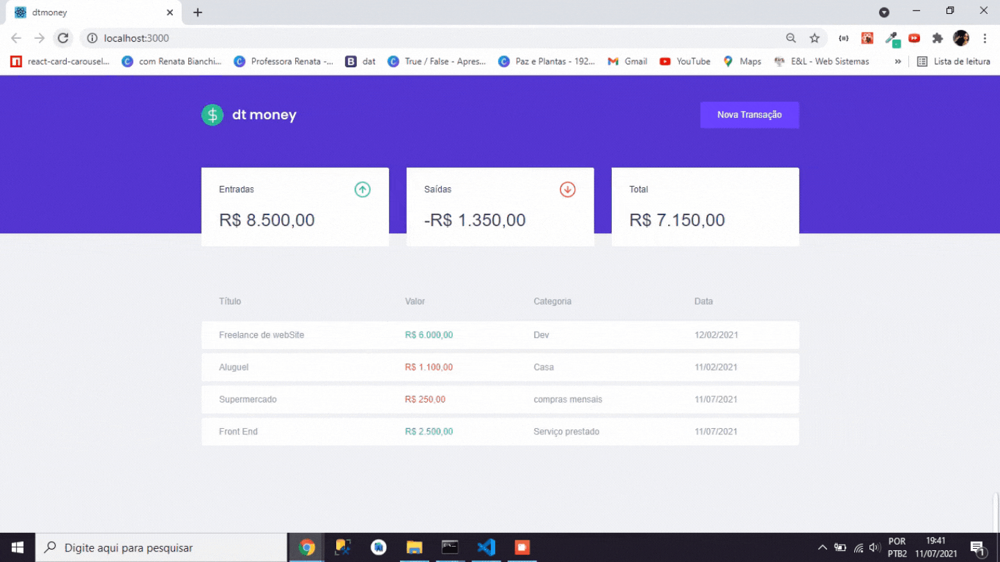

Sistema que realiza controle orçamentário, calculando entradas, saídas e o total gasto.  
 
 

Nessa aplicação foram trabalhados vários conceitos: 
<ul>
    <li> Componentes </li>
    <li> Parâmetros </li>
    <li> Consumo de API </li>
    <li> Modal e Forms </li>
    <li> Tratamento de dados (data e dinheiro) </li>
    <li> Midlewares </li>
    <li> Contextos </li>
    <li> Hooks </li>
    
</ul>

As principais ferramentas foram *NodeJS, Express, Typescript, Banco de dados relacional ORM SQlite.* 

  

